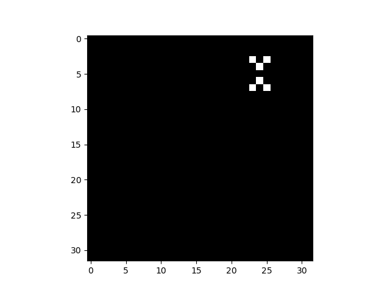

Table of Contents
-----------------


# Setup Python Environment
- Set the name of environment in both files: `environment.yml` and `Makefile`. The default name is `aba`, aka "all backdoor attacks" and then run following commands:
```
    make install
```

# Guideline for custome training (Atk vs Def)

## Data Customization
- [Data Loader](https://github.com/FedML-AI/FedML/blob/master/doc/en/simulation/user_guide/data_loader_customization.md)

## Datasets and Models Customization
- [Datasets and Models](https://github.com/FedML-AI/FedML/blob/master/doc/en/simulation/user_guide/datasets-and-models.md#datasets-and-models)
- [FedML Data](https://github.com/FedML-AI/FedML/tree/master/python/fedml/data)

## Attack Customization
### [Model Replacement Attack (MRA)](https://arxiv.org/pdf/1807.00459.pdf)
- [Code](https://github.com/ebagdasa/backdoors101) is in `fedlearn-backdoor-attacks/3DFed/attacks/modelreplace.py`


## Defense Customization

## Training Customization

## Evaluation Customization

## Visualization Customization

## Result Customization


## Flow of the code:
### [3DFed (ThrDFed) - S&P'23](https://github.com/haoyangliASTAPLE/3DFed)
- Init data, attack, defense method in `fedlearn-backdoor-attacks/3DFed/helper.py`
- Run fl round in `fedlearn-backdoor-attacks/3DFed/training.py`
    - Sample user for round (fl_no_models/ fl_total_participants)
    - Init FLUser (user_id, compromised, train_loader)
        - Single epoch attack: user_id = 0 is attacker, compromised = True
        - Otherwise: check if epoch in attack_epochs, if yes, check list adversaries
    - Training for each user
        - If user is attacker, run attack for only user_id = 0 [missing other attackers], that means training models on poisoned data
        - Otherwise, run defense for all users
    - Perform Attack and aggregate results
        - check update_global_model with weight: 1/total_participants (self.params.fl_eta / self.params.fl_total_participants)
    - Limitation: Currently, dump fl_no_models (set = fl_total_participants) models  in each round into file, only one attacker is supported (other attackers is duplicated from attacker 0)
### [DBA - ICLR'20 (Distributed Backdoor Attack)](https://github.com/AI-secure/DBA)
- List of adversarial clients in config file: adversary_list: [17, 33, 77, 11]
    - no_models: K = 10
    - number_of_total_participants: N = 100
- agent_name_keys: id of client that participate in each round (K/ N)
    - agent_name_keys = benign + adv (check adv first, then benign); set epoch attack for each client in .yaml file
In each communication round:
    - Check the trigger is global pattern or local pattern
    - Get poison batch data from adversary_index (-1, 0, 1, 2, 3)


### [Attack of the Tails: Yes, You Really Can Backdoor Federated Learning - NeurIPS'20](https://github.com/ksreenivasan/OOD_Federated_Learning)

Load poisoned dataset (in `simulated_averaging.py`):
```python
poisoned_train_loader, vanilla_test_loader, targetted_task_test_loader, num_dps_poisoned_dataset, clean_train_loader = load_poisoned_dataset(args=args)
```

Two modes (fixed-freq mode or fixed-pool mode):
```python
Intotal: N (num_nets) clients, K (part_nets_per_round) clients are participating in each round

- Fixed-freq Attack (`FrequencyFederatedLearningTrainer`): 
    - "attacking_fl_rounds":[i for i in range(1, args.fl_round + 1) if (i-1)%10 == 0]
    - poison_type in ["ardis": ["normal-case", "almost-edge-case", "edge-case"], "southwest"]
    - Training in each communication round: 
        - if round in attacking_fl_rounds, run attack
            - One attacker, and K-1 benign clients
            - For attacker, run attack in `adversarial_local_training_period` epochs 
                - data_loader = `poisoned_train_loader`
                - Check defense_technique in ["krum", "multi-krum"]: eps=self.eps*self.args_gamma**(flr-1); else eps=self.eps
                - Test on `vanilla_test_loader` and `targetted_task_test_loader`
                - Check model_replacement scale models with ratio: total_num_dps_per_round/num_dps_poisoned_dataset
                - Print norm before and after scale
            - For benign clients, run normal training in `local_training_period` epochs
                - data_loader = `clean_train_loader`
        - otherwise
            - run normal training with K benign clients
        - Aggregate models
            - using 
    - TODO: check prox-attack

    - test function:
        - check dataset:
            - dataset in ["mnist", "emnist"]:
                - target_class = 7
                - task in ["raw-task", "targeted"]
                - poison_type in ["ardis"]
            - dataset in ["cifar10"]:
                - target_class = 2 for greencar in ("howto", "greencar-neo"), 
                - target_class = 9 for southwest
        - TODO: check backdoor acc calculation (line 248-253)
    
- Fixed-pool Attack:
    - In each round of communication, randomly select K clients to participate in the training
        - selected_attackers from "__attacker_pool" (numpy random choice attacker_pool_size/ num_nets)
        - selected_benign_clients
        All attackers are sharing the same poisoned dataset
        - Training the same as Fixed-freq Attack for each attacker

- defense_technique in ["no-defense", "norm-clipping", "weak-dp", "krum", "multi-krum", "rfa"]
```
For more details, check `FedML` [dataset](https://github.com/FedML-AI/FedML/tree/master/python/fedml/data/edge_case_examples)

### [How To Backdoor Federated Learning (AISTATS'20)](https://github.com/ebagdasa/backdoors101)
- Generate trigger in file `synthesizers/pattern_synthesizer.py`. The 2 images below are the pattern of the trigger and image with trigger.
<!-- 
 -->
- All the original images and trigger images are normalized to [mean, std] of the original dataset

<div style="display:flex">
    
    
</div>

## TODO:
- [ ] Setting standard FL attack from Attack of the Tails and DBA
- [ ] Change dump to file -> dump to memory
- [ ] Check popular defense method: Foolsgold, RFA, ...

## Reference


# Source
- [FedMLSecurity: A Benchmark for Attacks and Defenses in Federated Learning and Federated LLMs](https://arxiv.org/pdf/2306.04959.pdf)
- [Attack and Defense of FedMLSecurity](https://github.com/FedML-AI/FedML/blob/master/python/fedml/core/security/readme.md)
- [fedMLSecurity_experiments](https://github.com/FedML-AI/FedML/tree/master/python/examples/security/fedMLSecurity_experiments)

